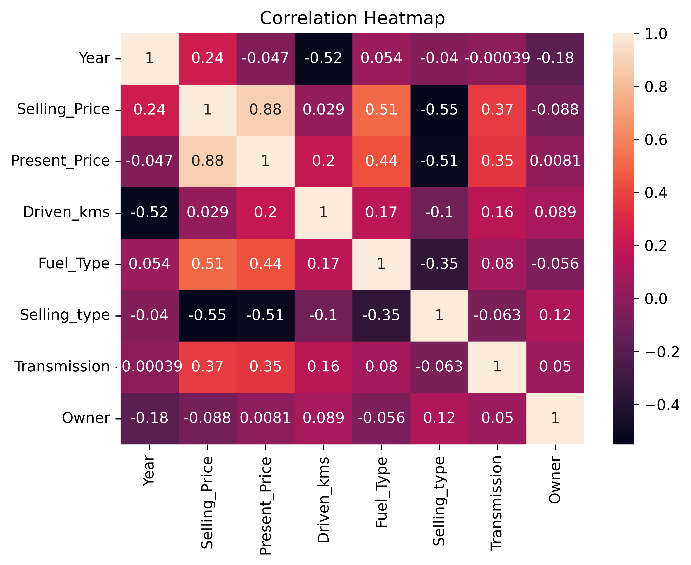
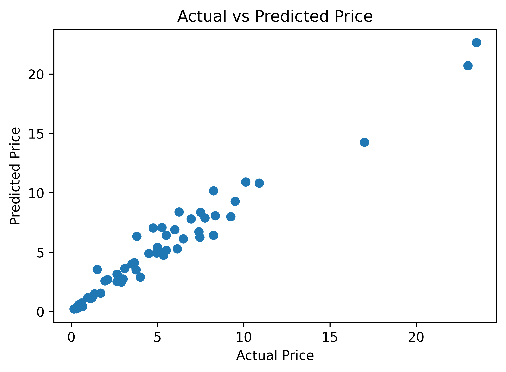

# 🚗 Car Price Prediction Using Machine Learning

This project was developed as part of the **CodeAlpha Data Science Internship**. The goal of this project is to predict the selling price of used cars using Machine Learning techniques based on various car-related features.

---

## 📌 Project Objective

To build a Machine Learning model that can accurately predict the selling price of a car using features such as:

- Present Price
- Driven Kilometers
- Fuel Type
- Transmission
- Selling Type
- Owner History
- Car Age

---

## 🛠️ Technologies Used

- Python
- Pandas
- NumPy
- Matplotlib
- Seaborn
- Scikit-Learn
- Jupyter Notebook

---

## 📊 Dataset Information

The dataset contains **301 car records** with the following attributes:

| Feature | Description |
|----------|------------|
| Car_Name | Name of the car |
| Year | Manufacturing year |
| Selling_Price | Selling price of the car (Target Variable) |
| Present_Price | Current showroom price |
| Driven_kms | Total kilometers driven |
| Fuel_Type | Petrol, Diesel, or CNG |
| Selling_type | Dealer or Individual |
| Transmission | Manual or Automatic |
| Owner | Number of previous owners |

---

## 📈 Exploratory Data Analysis

The following visualizations were created to understand the dataset:

### Fuel Type Distribution


### Transmission Distribution


### Correlation Heatmap



---

## ⚙️ Data Preprocessing

The following preprocessing steps were performed:

- Checked for missing values
- Created a new feature: **Car Age**
- Removed unnecessary columns
- Converted categorical variables into numerical values using One-Hot Encoding
- Split the dataset into training and testing sets

---

## 🤖 Machine Learning Model

### Random Forest Regressor

The dataset was divided into:

- **80% Training Data**
- **20% Testing Data**

A Random Forest Regressor model was trained to predict car selling prices.

---

## 📊 Model Performance

### R² Score

```text
0.9594
```

### Actual vs Predicted Price



### Result

The model achieved an **R² Score of 95.94%**, indicating excellent prediction performance and strong correlation between actual and predicted car prices.

---

## 📁 Repository Structure

```text
CodeAlpha_CarPricePrediction
│
├── car data.csv
├── Car_Price_Prediction.ipynb
├── fuel_type_hd.png
├── transmission_hd.png
├── correlation_heatmap_hd.png
├── actual_vs_predicted_hd.png
└── README.md
```

---

## 🎯 Learning Outcomes

Through this project, I learned:

- Data Cleaning
- Data Visualization
- Feature Engineering
- Machine Learning Regression
- Random Forest Algorithm
- Model Evaluation using R² Score
- End-to-End Machine Learning Workflow

---

## 🚀 Conclusion

This project demonstrates how Machine Learning can be used to predict used car prices based on multiple vehicle characteristics. The Random Forest Regressor model performed exceptionally well and achieved an R² Score of **95.94%**, making it a reliable solution for car price prediction.

---

## 👨‍💻 Author

**Mamun Reja**

B.Tech (Artificial Intelligence & Machine Learning)

CodeAlpha Data Science Intern
